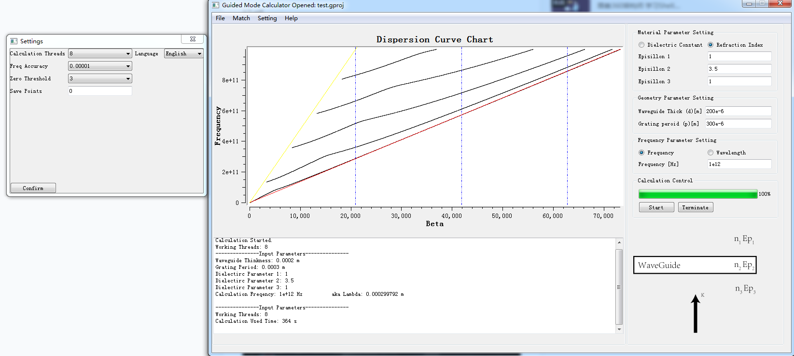

# GuidedModeGUI
This is a GUI tool to calculate the guided mode in the dielectric slab matched with given couple grating periods.

## Release 0.5 Beta

1. Finish all the Core Calculation Functions.

2. Implement System Setting Parameters restore from disk.

3. Implement Project Data Save to disk.

4. Implement Export Data to Text , Image and Comma Split File.

   ### Screen Shot

